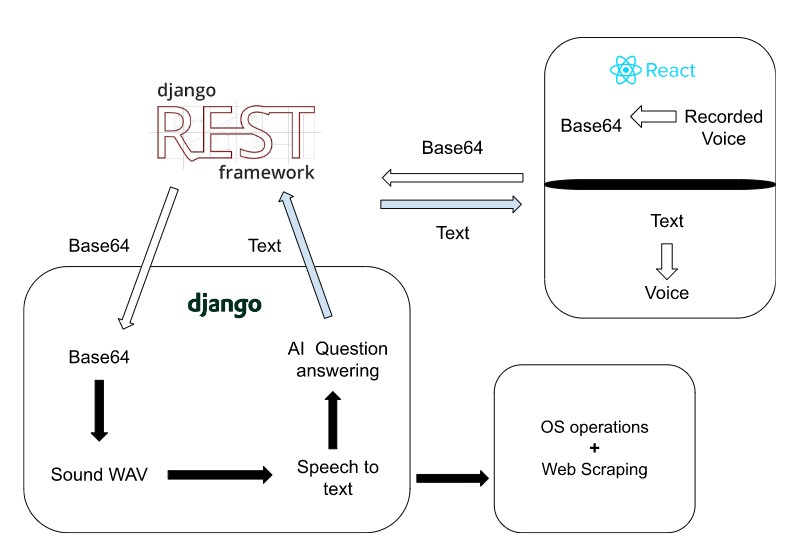

# Personal-Assistant
Personal-assitant  Web voice personal assistant using state-of-the-art NLP algorithms Seq2Seq models

Technologies: 
    -Django, ReactJS, Tensorflow, Keras,
    Beautiful soup, Bootstrap, Postgresql, Django REST framework


## Application Architecture
<p align="center">

</p><br>


### Run Backend
```
cd backend
pip install -r requirements.txt

#run backend
python manage.py runserver
```

### Run Frontend
```
cd frontend
npm start
```

